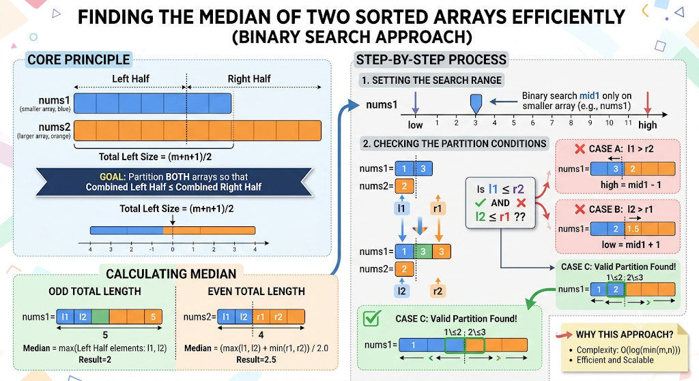

# [Median of 2 Sorted Arrays](https://leetcode.com/problems/median-of-two-sorted-arrays/)

## Resources

- [Striver's SDE Sheet](https://takeuforward.org/dsa/strivers-sde-sheet-top-coding-interview-problems)

## Problem Description

Given two sorted arrays nums1 and nums2 of size m and n respectively, return the median of the two sorted arrays.

The overall run time complexity should be O(log (m+n)).

Example 1:

```
Input: nums1 = [1,3], nums2 = [2]
Output: 2.00000
Explanation: merged array = [1,2,3] and median is 2.
```

Example 2:

```
Input: nums1 = [1,2], nums2 = [3,4]
Output: 2.50000
Explanation: merged array = [1,2,3,4] and median is (2 + 3) / 2 = 2.5.
```

Constraints:

```
nums1.length == m
nums2.length == n
0 <= m <= 1000
0 <= n <= 1000
1 <= m + n <= 2000
-106 <= nums1[i], nums2[i] <= 106
```

## Code with Explaining annotations



```cpp
class Solution {
public:
    double findMedianSortedArrays(vector<int>& nums1, vector<int>& nums2) {
        int n1 = nums1.size();
        int n2 = nums2.size();

        // 1. ALWAYS SEARCH ON THE SMALLER ARRAY
        // We do this to ensure our time complexity remains O(log(min(m, n))).
        // If nums1 is larger, we swap them by recursively calling the function.
        if (n1 > n2) return findMedianSortedArrays(nums2, nums1);

        int low = 0, high = n1;
        int n = n1 + n2; // Total number of elements

        // 2. CALCULATE LEFT HALF SIZE
        // For an array of size n, the left half will contain (n + 1) / 2 elements.
        // This cleverly handles both odd and even total lengths:
        // - If n=7: left = (7+1)/2 = 4. The median is the max of the left half.
        // - If n=8: left = (8+1)/2 = 4. The median is avg(max(left half), min(right half)).
        int left = (n1 + n2 + 1) / 2;

        // 3. BINARY SEARCH FOR THE PERFECT PARTITION
        while (low <= high) {
            // mid1 is the number of elements we pick from nums1 for the left half.
            int mid1 = (low + high) >> 1; // same as (low + high) / 2

            // mid2 is the remaining number of elements we MUST pick from nums2
            // so that the total elements in the left half equals 'left'.
            int mid2 = left - mid1;

            // Initialize edge elements to MIN and MAX infinity.
            // This handles cases where the partition falls on the extreme edges (0 or n).
            int l1 = INT_MIN, l2 = INT_MIN;
            int r1 = INT_MAX, r2 = INT_MAX;

            // 4. FIND THE 4 ELEMENTS AROUND THE PARTITIONS
            // l1: last element in left half of nums1
            // r1: first element in right half of nums1
            // l2: last element in left half of nums2
            // r2: first element in right half of nums2
            if (mid1 < n1) r1 = nums1[mid1];
            if (mid2 < n2) r2 = nums2[mid2];
            if (mid1 - 1 >= 0) l1 = nums1[mid1 - 1];
            if (mid2 - 1 >= 0) l2 = nums2[mid2 - 1];

            // 5. CHECK IF THE PARTITION IS VALID
            // A valid partition means EVERY element on the left is <= EVERY element on the right.
            // Since arrays are already sorted, l1 <= r1 and l2 <= r2 are naturally true.
            // We only need to check the cross boundaries!
            if (l1 <= r2 && l2 <= r1) {
                // We found the perfect partition!
                // If total elements is odd, median is the largest element on the left side.
                if (n % 2 == 1) return max(l1, l2);

                // If total elements is even, median is the average of the two middle elements.
                // Which are: max of the left side, and min of the right side.
                return (double) (max(l1, l2) + min(r1, r2)) / 2.0;
            }
            // 6. ADJUST THE BINARY SEARCH BOUNDARIES
            else if (l1 > r2) {
                // l1 is too large, meaning we took too many elements from nums1.
                // We must move our partition to the left.
                high = mid1 - 1;
            }
            else {
                // l2 is too large, meaning we didn't take enough elements from nums1
                // (which forced us to take too many from nums2).
                // We must move our partition to the right.
                low = mid1 + 1;
            }
        }
        return 0.0;
    }
};

/* ==============================================================================
   DRY RUN / EXECUTION TRACE
   ==============================================================================
   Let's trace:
   nums1 = [1, 3, 4]      (n1 = 3)
   nums2 = [2, 5, 6]      (n2 = 3)

   Total elements (n) = 6.
   Required elements in left half (left) = (3 + 3 + 1) / 2 = 3.
   We want to partition both arrays such that the left side has 3 elements
   and all left elements <= all right elements.

   Initial variables:
   low = 0, high = 3

   --- ITERATION 1 ---
   mid1 = (0 + 3) / 2 = 1. (We take 1 element from nums1: [1])
   mid2 = left - mid1 = 3 - 1 = 2. (We take 2 elements from nums2: [2, 5])

   Finding our 4 boundaries:
   l1 = nums1[mid1-1] -> nums1[0] = 1
   r1 = nums1[mid1]   -> nums1[1] = 3
   l2 = nums2[mid2-1] -> nums2[1] = 5
   r2 = nums2[mid2]   -> nums2[2] = 6

   Current Visual Partition:
   nums1:  [1]      |  [3, 4]
   nums2:  [2, 5]   |  [6]

   Check condition: is l1 <= r2 AND l2 <= r1?
   - 1 <= 6 (True)
   - 5 <= 3 (False! l2 is too big)

   Action: Since l2 > r1, we need MORE elements from nums1 to push l2 smaller.
   low = mid1 + 1 -> 1 + 1 = 2.

   --- ITERATION 2 ---
   low = 2, high = 3
   mid1 = (2 + 3) / 2 = 2. (We take 2 elements from nums1: [1, 3])
   mid2 = left - mid1 = 3 - 2 = 1. (We take 1 element from nums2: [2])

   Finding our 4 boundaries:
   l1 = nums1[mid1-1] -> nums1[1] = 3
   r1 = nums1[mid1]   -> nums1[2] = 4
   l2 = nums2[mid2-1] -> nums2[0] = 2
   r2 = nums2[mid2]   -> nums2[1] = 5

   Current Visual Partition:
   nums1:  [1, 3]   |  [4]
   nums2:  [2]      |  [5, 6]

   Check condition: is l1 <= r2 AND l2 <= r1?
   - 3 <= 5 (True)
   - 2 <= 4 (True)

   Result: Condition met! We found the perfect partition.
   Since n = 6 (Even), we use the even logic:
   Median = (max(l1, l2) + min(r1, r2)) / 2.0
   Median = (max(3, 2) + min(4, 5)) / 2.0
   Median = (3 + 4) / 2.0
   Median = 3.5

   Returns 3.5.
   ============================================================================== */
```
